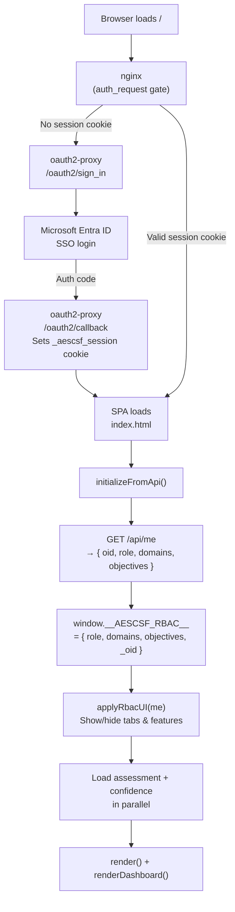
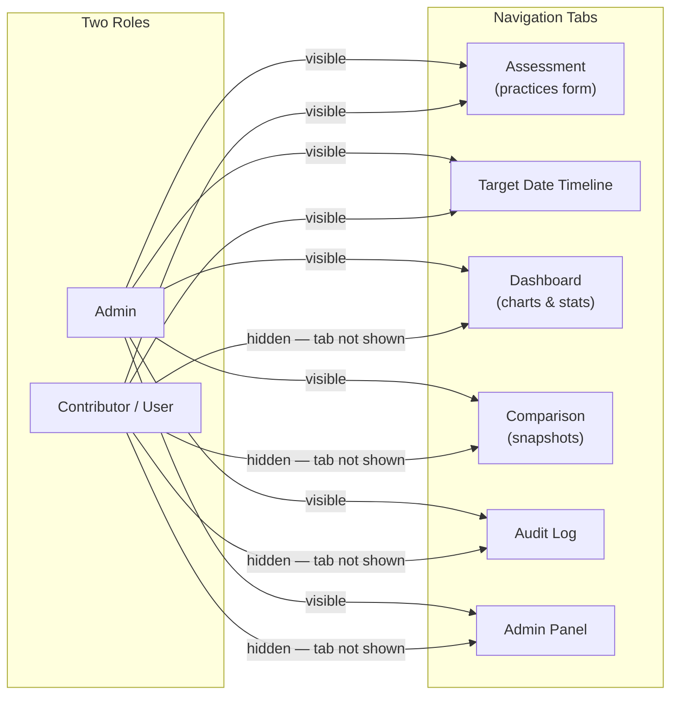
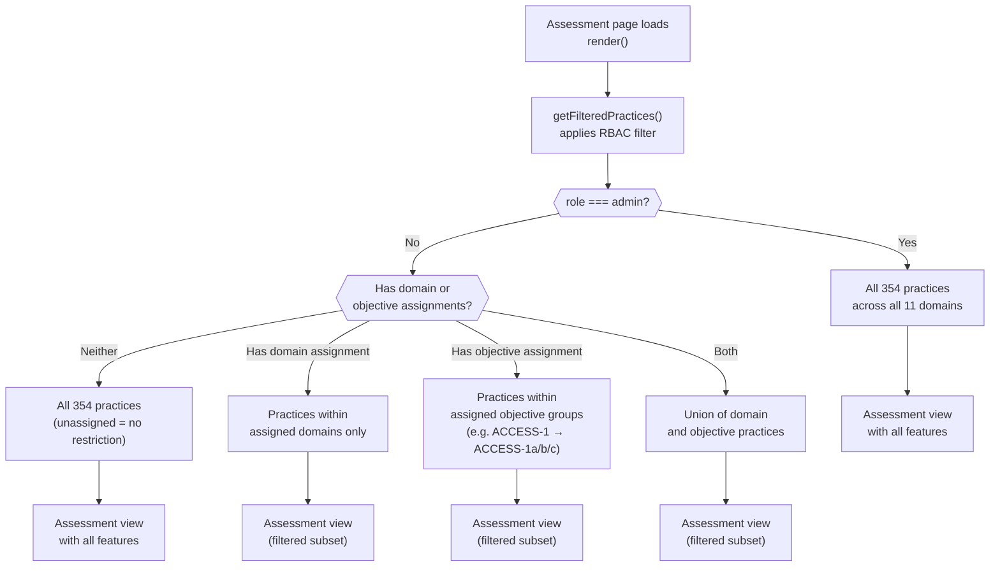
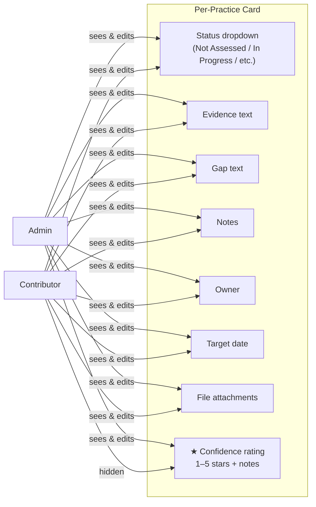
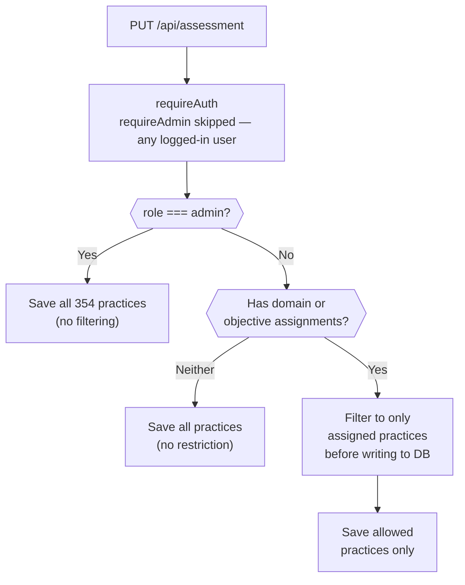
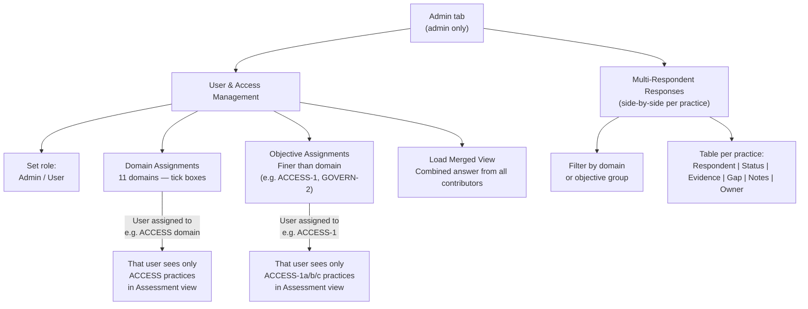
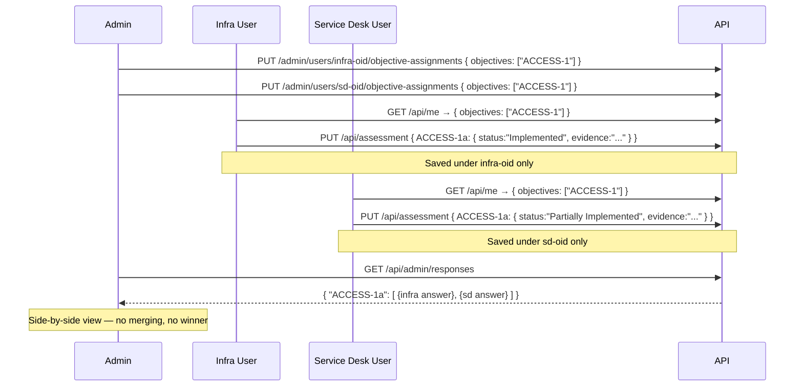
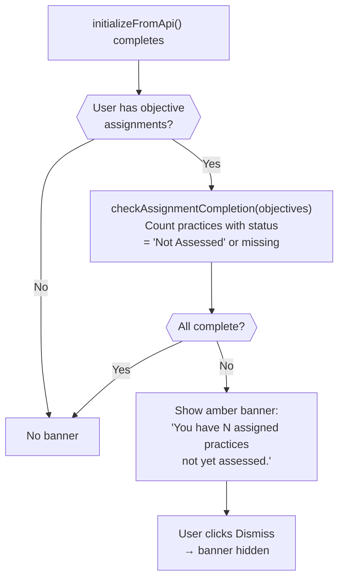
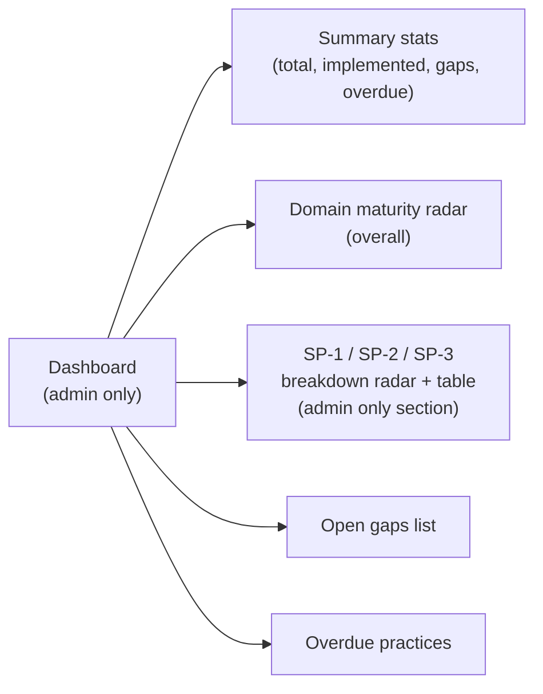
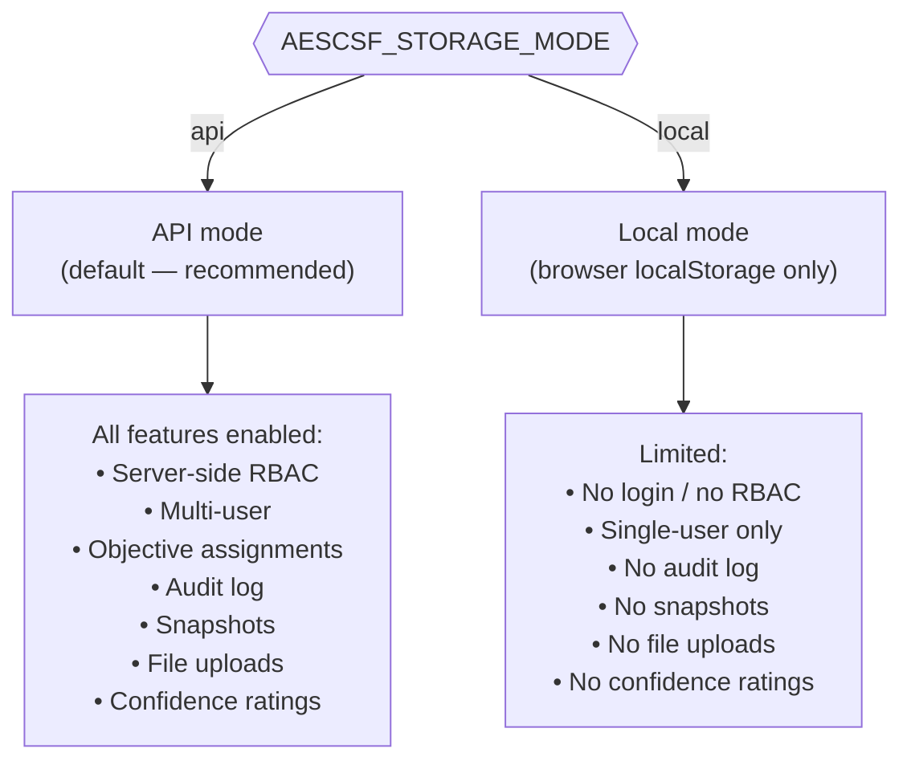

# AESCSF v2 — UI Logic Diagram

## Authentication & Initialisation Flow

---

## User Roles & Page Access

---

## Assessment Page — Practice Filtering by Role

---

## Assessment Page — Features by Role

---

## Assessment Save — Server-Side Enforcement

---

## Admin Panel — Features

---

## Multi-Respondent Flow

---

## Incomplete Assignment Banner

---

## Dashboard — Admin-Only Features

---

## Storage Modes

